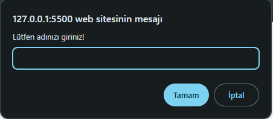
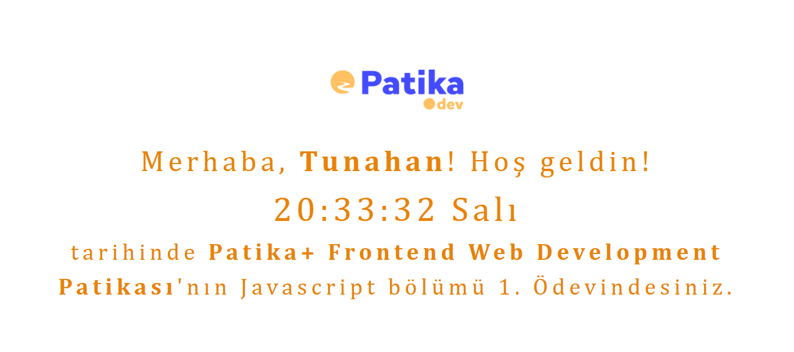

# :clock7: Javascript Saat ve Karşılama

* Bu proje, Patika Frontend Bootcamp'i için oluşturulan **Hafta-5 / Ödev-1 / İlk Javascript** projesidir.
* **JS** alıştırması için bir pratik projesidir.
* **HTML**, **CSS** ve **JS** kullanılmıştır.
---

## :computer: Kullanım

1.  Hafta-5 projelerimin olduğu toplu repomu klonlayın.
*   git clone https://github.com/tunahanyasar/Hafta-5.git
2. Odev-5 dosyasını çalıştırın.

---

## 📜 Sayfa Yapısı

:open_file_folder: **Klasörler;**
* *index.html*
* *css/style.css*
* *js/clock.js*
* *img-page*

1. ***index.html***: Projenin ana sayfasıdır. Sayfa yüklendiğinde isim girilmesini isteyen bir **Prompt Alert** karşılar.
3.  ***css/style.css:*** index.html için yazılan CSS özellikleri bu dosyada derlenmiştir. 
4. ***js/clock.js:*** index.html için yazılan JavaScript kodları bu dosyada derlenmiştir. 
4. ***img-page:*** Proje sayfa çıktı görsellerinin bulunduğu klasör.

---
## :star2: Özellikler

1. Onload() olarak yazılan promt alert:

    
      
            
2. Onload() olarak yazılan anlık saat çıktısı:

    
            
   
3. If döngüsü ve Function ile 10'dan küçük rakamlı saat öğlerinin başına "0" eklemek;

    
          

 
## 💡 Kullanılan Yapılar | Kazanımlar

**HTML**

**CSS**

**Bootstrap**

**JS:**
*   Array
*   Function
*   Event
*   If

---

## :paperclip: Sayfa Çıktıları

